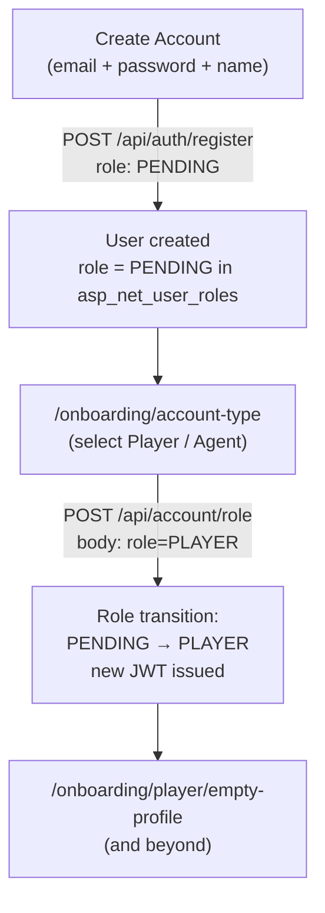

# Decouple account creation from role selection

## Design overview



A `PENDING` role is the right primitive here because:
- ASP.NET Identity requires a concrete role row to issue a JWT with `ClaimTypes.Role`
- `asp_net_user_roles` is a join table — no DB schema change needed, just a new seeded role
- It keeps "no role" explicit and traceable rather than a null/fallback

---

## Backend changes

### 1. Add `PENDING` role constant and enum value

- [`src/api/GlobalScout.Domain/Identity/AppRoleNames.cs`](src/api/GlobalScout.Domain/Identity/AppRoleNames.cs) — add `public const string Pending = "PENDING";` and include in `All`
- [`src/api/GlobalScout.Domain/Identity/UserRole.cs`](src/api/GlobalScout.Domain/Identity/UserRole.cs) — add `Pending = 4`
- [`src/api/GlobalScout.Infrastructure/Identity/IdentityDataSeeder.cs`](src/api/GlobalScout.Infrastructure/Identity/IdentityDataSeeder.cs) — seed the `PENDING` role at startup (alongside existing PLAYER/CLUB/SCOUT_AGENT/ADMIN seeds)

### 2. Update registration to default to `PENDING`

- [`src/api/GlobalScout.Application/Auth/Register/RegisterUserCommandValidator.cs`](src/api/GlobalScout.Application/Auth/Register/RegisterUserCommandValidator.cs) — allow `PENDING` as a valid registration role (add to `IsAllowedRegistrationRole`; no profile fields required for PENDING)
- [`src/api/GlobalScout.Application/Auth/Register/RegisterUserCommand.cs`](src/api/GlobalScout.Application/Auth/Register/RegisterUserCommand.cs) — make `Role` optional with a default of `"PENDING"` (or keep required but accept PENDING)
- [`src/api/GlobalScout.Infrastructure/Identity/UserIdentityStore.cs`](src/api/GlobalScout.Infrastructure/Identity/UserIdentityStore.cs) — update the `RegisterAsync` profile-creation block: a `PENDING` user gets a profile row with only `FirstName`/`LastName` (no position/age/clubName). Update the `PLAYER` fallback in `GetRolesAsync` reads to fall back to `"PENDING"` instead of `"PLAYER"`.

### 3. New `SetUserRole` use-case

New files:
- `src/api/GlobalScout.Application/Account/SetRole/SetUserRoleCommand.cs` — `record SetUserRoleCommand(Guid UserId, string NewRole)`
- `src/api/GlobalScout.Application/Account/SetRole/SetUserRoleCommandHandler.cs` — validates user currently holds `PENDING`, removes it, adds `NewRole`, re-issues JWT
- `src/api/GlobalScout.Application/Account/SetRole/SetUserRoleCommandValidator.cs` — `NewRole` must be a valid non-PENDING, non-ADMIN role

New interface method on `IUserIdentityStore`:
```csharp
Task<Result<SetUserRoleOutcome>> SetRoleAsync(Guid userId, string newRole, CancellationToken ct);
```

`SetUserRoleOutcome` carries `NewRole` and a new `Token` string.

### 4. New API endpoint `POST /api/account/role`

- [`src/api/GlobalScout.Api/Endpoints/Account/AccountRoutes.cs`](src/api/GlobalScout.Api/Endpoints/Account/AccountRoutes.cs) — add new route
- New file `src/api/GlobalScout.Api/Endpoints/Account/PostAccountSetRole.cs`:
  - `.RequireAuthorization()` (authenticated, no role policy — PENDING users pass generic `[Authorize]`)
  - Body: `{ "role": "PLAYER" }`
  - Calls `SetUserRoleCommand`
  - Returns `{ "token": "<new_jwt>", "user": { ... } }`

---

## Shared types changes

- [`src/ui/packages/shared/src/types/auth.ts`](src/ui/packages/shared/src/types/auth.ts) — make `RegisterRequest.role` optional (`role?: string`)

---

## Frontend changes

### 5. BFF register route — send `PENDING` (or omit role)

- [`src/ui/apps/web/app/api/auth/register/route.ts`](src/ui/apps/web/app/api/auth/register/route.ts) — change `role: "PLAYER"` → `role: "PENDING"`

### 6. New BFF route `POST /api/account/set-role`

- New file `src/ui/apps/web/app/api/account/set-role/route.ts`:
  - Proxies to backend `POST /api/account/role`
  - On success: **sets the new JWT as the auth cookie** (so the HTTP-only cookie is updated)
  - Returns `{ user, redirectTo }` to the client

### 7. `getPostAuthRedirect` — handle `PENDING`

- [`src/ui/apps/web/lib/auth/get-post-auth-redirect.ts`](src/ui/apps/web/lib/auth/get-post-auth-redirect.ts) — add `PENDING` branch before the `PLAYER` check:
  ```ts
  if (role === "PENDING") return ONBOARDING_ACCOUNT_TYPE_PATH;
  ```

### 8. Onboarding layout — allow `PENDING` users through to account-type

- [`src/ui/apps/web/app/(onboarding)/onboarding/layout.tsx`](src/ui/apps/web/app/(onboarding)/onboarding/layout.tsx) — change guard from `role !== "PLAYER"` to `role !== "PLAYER" && role !== "PENDING"`. PENDING users can enter the account-type page but not the player sub-routes (those pages keep their own `role !== "PLAYER"` guard).

### 9. Account-type page — call set-role on selection

- [`src/ui/apps/web/app/(onboarding)/onboarding/account-type/page.tsx`](src/ui/apps/web/app/(onboarding)/onboarding/account-type/page.tsx) — the "Player" card currently navigates client-side. Convert it to a server action or client handler that:
  1. `POST /api/account/set-role` with `{ role: "PLAYER" }`
  2. On success, calls `setUser(data.user)` + `router.refresh()` to update the session
  3. Then navigates to `/onboarding/player/empty-profile`
- The `AccountTypeCard` component needs an `onClick` prop (optional, for when role assignment is required) in addition to the existing `href` navigation.

---

## What does NOT change

- DB schema — no migration needed; `PENDING` is a seeded role like `PLAYER`
- Middleware — still only checks cookie presence, no role logic
- All player onboarding sub-pages — their `role !== "PLAYER"` guard already correctly blocks PENDING users
- `already-signed-in` panel, `sign-out-button`, `onboarding-session-actions` — no changes
