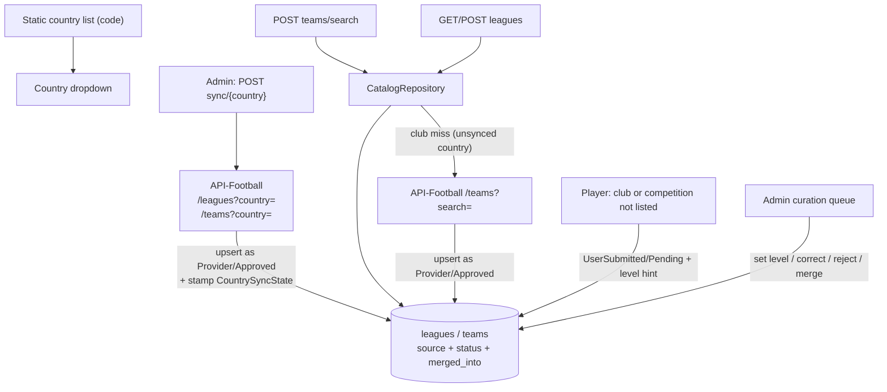

# Reference data catalog (countries, leagues, teams)

Prerequisite for the self-reported player statistics plan. That feature needs a club and a competition per season entry, and today the competition side has nothing behind it.

## Why this is needed

Current state, confirmed by reading the subsystem:

- **Countries are static data pretending to be a data file.** `Data/countries.json` holds 171 entries loaded once into a singleton. Every entry has a country code, and the flag URL is pure convention (`https://media.api-sports.io/flags/{code}.svg`), so the whole file is really 171 name/code pairs.
- **Teams are a stale snapshot.** The 10 preloaded files carry 7,665 clubs (Romania alone has 439, far more than Liga I's 16), pulled from API-Football `/teams?country=` at some unrecorded point in the past. Other countries fall back to a live `GET teams?search=&country=`.
- **Leagues are the blocker.** Every preloaded file contains exactly one league, the top domestic tier. `IReferenceDataStore.GetLeagues()` is populated at startup but **no query, handler or endpoint exposes it**, so there is nothing to drive a competition picker, and the one tier we do have is the one untracked players are definitionally not in.
- **No caching.** Every autocomplete request past the 300ms debounce is a fresh API-Football call against the quota.
- **No escape hatch.** A club or competition that isn't in the data simply cannot be selected.
- **No regeneration tooling and no docs** for the preloaded files.

## The asymmetry that shapes the design

Clubs and competitions need different strategies, because the provider covers them very differently.

API-Football's coverage list gives Romania **17 competitions**: Liga I, Liga II, the ten Liga III series plus its play-offs, Cupa României, Supercupa and Liga 1 Feminin. It stops at the third tier — no Liga IV, no county leagues, no junior or academy competitions. Its `teams?country=` data, by contrast, yields 439 Romanian clubs, reaching well below Liga III.

So the provider is a strong source for clubs and a thin one for competitions. A full country sync takes Romania from nothing to ~17 competitions, all of them tiers 1–3 plus cups, which is exactly the band our target user is *not* in. **Player submissions are the primary input for competitions**, not an escape hatch.

## Design

Five ideas carry the plan.

**1. The JSON files go away completely.** No seeding, no file reader, no content-copy build step, no `PreloadedCountries` config. The checked-in club data is an undated snapshot that nobody can regenerate, and keeping it means maintaining two code paths for the same question. Deleting it also removes an entire class of deployment risk around whether data files reach a container's publish output.

**2. Countries are a static list in code.** 171 name/code pairs in the Application layer with the flag URL derived, served directly by `GetFootballCountriesQueryHandler` with no database round-trip and no external dependency. The country dropdown therefore works on a completely empty database with no API key.

**3. The catalog is populated by an admin per-country sync, with write-through club search as the gap-filler.** `POST /api/admin/reference-data/sync/{country}` pulls that country's leagues and teams. A country nobody has synced starts empty; club search still works there because a local miss falls through to `GET teams?search=&country=` and upserts what comes back. Competitions in an unsynced country come from player submissions.

**4. Every row carries provenance and status.** `source` is `Provider`, `UserSubmitted` or `AdminCurated`; `status` is `Approved`, `Pending`, `Rejected` or `Merged`. Pending rows **are visible to everyone**, rendered with an unverified marker — hiding them from other users would guarantee that three players from the same amateur club each submit it and leave an admin to merge three rows by hand.

**5. Level is admin-owned.** A competition's level is a property of the competition, not of whoever happened to submit it, and it is the single field a player has an incentive to inflate on a scouting platform. The submitter's answer is recorded as a **hint on the submission record**; the shared league row stays `Unknown` until an admin sets the authoritative value on approval.

**6. Consumers store the catalog id alongside a denormalized name.** A stats row records `{ clubId, clubName, competitionId, competitionName }`. Display never breaks when an id goes stale, a player's 2019 club name doesn't silently change because an admin merged two rows in 2027, and merge resolution becomes an optional data-quality task rather than a load-bearing read path. A merged row still keeps a `merged_into_*_id` pointer for admin tooling and future scout filtering, but nothing on the hot read path has to follow it.

---

## 1. Domain

New folder `src/api/GlobalScout.Domain/ReferenceData/`:

- `League` — `Id`, `CountryCode`, `Name`, `NameNormalized`, `ExternalLeagueId` (`int?`), `Type`, `Level`, `LogoUrl`, `Source`, `Status`, `MergedIntoLeagueId`, `SubmittedByUserId`, `SubmittedLevelHint`, timestamps.
- `Team` — same shape with `ExternalTeamId` (`int?`), `Code`, `Founded`, `IsNational`.
- `CountrySyncState` — `CountryCode` (PK), `LeaguesSyncedAt`, `TeamsSyncedAt`, `LeagueCount`, `TeamCount`, `LastSyncedByUserId`. A ledger of what the admin has pulled, not a copy of the country list.
- `CompetitionLevel` enum — `Unknown`, `ProfessionalTier1`, `ProfessionalTier2`, `ProfessionalTier3`, `SemiPro`, `Amateur`, `YouthAcademy`, `SchoolUniversity`.
- `ReferenceDataSource` enum — `Provider`, `UserSubmitted`, `AdminCurated`.
- `ReferenceDataStatus` enum — `Approved`, `Pending`, `Rejected`, `Merged`.

There is deliberately **no `Country` entity and no foreign key to one**. Country is a static two-letter code validated in the application layer against the hardcoded list; leagues and teams carry an indexed `country_code` column. This keeps the sync ledger independent, so a submission in a never-synced country doesn't have to create a parent row first.

`NameNormalized` is written using the existing [TextNormalizer.cs](src/api/GlobalScout.Application/Common/TextNormalizer.cs) (`RemoveDiacritics` plus lowercase) so search is accent-insensitive.

`CompetitionLevel` deliberately flattens two axes — a tier (`ProfessionalTier1..3`, `SemiPro`, `Amateur`) and a category (`YouthAcademy`, `SchoolUniversity`). A U19 academy league at a top-flight club is genuinely both, and the flat enum forces a lossy choice. Accepted for now because only an admin sets the value and the set can be split into `Tier` + `Category` later without touching player-facing contracts; see Deferred.

A team-to-league join is deliberately **not** modelled. The manual stats form picks club and competition independently, and API-Football's `/teams?country=` gives no league membership anyway.

### `Team` is not the existing `Club` entity

`GlobalScout.Domain/Clubs/Club.cs` looks superficially similar but models a different thing: an organisation profile for a club that holds an account, with `Website`, `Description` and `City`, matching the `CLUB` account role. The catalog `Team` is a reference row — tens of thousands per synced country, provider-owned, carrying provenance, status and merge pointers, and almost never corresponding to an account.

They cannot be one table. A provider catalog has no use for `Website` or `Description`, an account profile has no use for `ExternalTeamId` or `Status`, and `clubs` carries a **unique index on `Name`** that the provider data would immediately violate.

`Club` is also dead: nothing reads or writes it, and `Profile` already carries `ClubName`, `ClubLogo`, `Website`, `Country` and `City` for club accounts. It is deleted under `retire-dead-schema` rather than left to sit confusingly beside `Team`.

## 2. Countries as static data

New `Application/ReferenceData/FootballCountries.cs`: a static array of 171 `(Name, Code)` pairs — the current `countries.json` contents, where every entry already has a code — with `FlagUrl` derived as `https://media.api-sports.io/flags/{code-lowercase}.svg`.

`GetFootballCountriesQueryHandler` reads it directly. No database, no HTTP, no options binding. This is the one part of reference data that must work on a cold install, because it gates every other picker.

## 3. Persistence

- Entity configuration in [GlobalScoutDbContext.cs](src/api/GlobalScout.Infrastructure/Data/GlobalScoutDbContext.cs) following the existing snake_case style.
- **Identity is the external id, not the name.** Unique index on `external_league_id` / `external_team_id` where not null. The normalized-name index within a country is **non-unique**: the provider data contains genuine duplicate names — the old England, Italy, France, Portugal, Spain and Turkey snapshots had 14 duplicate-name groups between them, including two distinct French clubs both called "Abbeville". A unique constraint would reject legitimate provider rows mid-sync. Name collisions are a **soft signal** feeding the admin duplicate-review queue, not a database constraint.
- Enable `pg_trgm` with `HasPostgresExtension("pg_trgm")` in the model rather than raw `migrationBuilder.Sql`, so the extension stays in the snapshot, and add a GIN index on `name_normalized` with an explicit `gin_trgm_ops` operator class. This is what makes the unanchored `LIKE '%term%'` behind the autocomplete index-accelerated instead of a sequential scan, and it supplies `similarity()` for ranking and typo tolerance on top of the accent handling `TextNormalizer` already does. Privileges are not a concern here: production runs `postgres:17-alpine` in Compose with the migrator connecting as the image's superuser database owner, and `pg_trgm` has been a trusted extension since Postgres 13 in any case.
- **No new migration file.** As with the statistics plan, `20260704140241_InitialCreate` is untracked and the database can be reset, so remove and re-scaffold that single migration plus the model snapshot.

## 4. Retiring the JSON and the unused Club entity

Delete outright:

- `Infrastructure/ReferenceData/Data/countries.json` and the 10 files under `Data/Preloaded/`.
- `Infrastructure/ReferenceData/JsonReferenceDataStore.cs` and the `IReferenceDataStore` abstraction.
- The `<None Update="ReferenceData\Data\**\*.json">` item in `GlobalScout.Infrastructure.csproj`.
- `ReferenceDataOptions.PreloadedCountries` and its configuration entries.
- `FootballCountryDto.IsPreloaded` — declared in `reference-data-types.ts` and rendered nowhere, and meaningless once every country is catalog-backed.
- `Domain/Clubs/Club.cs`, its `DbSet<Club>` and the `clubs` table. Unused everywhere, superseded by the club fields on `Profile`, and its unique `Name` index is the exact constraint the catalog cannot have. Since `InitialCreate` is being re-scaffolded, this costs nothing.

The `IsPreloadedCountry` branch in the search handler goes with it, which also resolves the odd split between a 2-character local threshold and a 3-character external one.

## 5. Application layer

- Replace `IReferenceDataStore` with `IReferenceDataCatalog` in `Abstractions/ReferenceData/`: `SearchTeamsAsync`, `SearchLeaguesAsync`, `ListLeaguesAsync`, `UpsertProviderTeamsAsync`, `UpsertProviderLeaguesAsync`, `SubmitTeamAsync`, `SubmitLeagueAsync`. The blast radius is small: the interface appears in six places today.
- **Provider upserts must be conflict-safe.** A sync and a concurrent write-through search can insert the same rows, racing the unique external-id index. Use `ON CONFLICT DO NOTHING` via raw SQL (EF has no native upsert) or catch `DbUpdateException` and re-read.
- Extend the DTOs in [ReferenceDataDtos.cs](src/api/GlobalScout.Application/Abstractions/ReferenceData/ReferenceDataDtos.cs): both `FootballTeamDto` and `FootballLeagueDto` gain a catalog `Id` (Guid), an `IsVerified` flag derived from source and status, and `ExternalTeamId`/`ExternalLeagueId` become **nullable**. `FootballLeagueDto` also gains `Level`.
- Rewrite [SearchFootballTeamsQueryHandler.cs](src/api/GlobalScout.Application/ReferenceData/SearchTeams/SearchFootballTeamsQueryHandler.cs) to search the catalog, and on a thin result call `IExternalTeamSearch`, upsert the hits as `Provider`/`Approved`, then return the merged list. This is what keeps an unsynced country usable.
- New `ReferenceData/SearchLeagues/` and `ReferenceData/ListLeagues/` use cases, served **from the catalog only** — no per-search provider call, since a country's competition list arrives in one sync and changes yearly.
- New `IExternalLeagueSearch` over API-Football `GET leagues?country=`, the provider endpoint the codebase never calls today, used only by the sync.
- New `ReferenceData/SubmitTeam/` and `ReferenceData/SubmitLeague/` use cases. A league submission carries an optional `LevelHint` stored on the submission; it never sets the shared row's `Level`. Both throttle per user (cap on outstanding `Pending` rows) with a new `ReferenceDataErrors.TooManyPendingSubmissions`.
- Phase 2 — `ReferenceData/Admin/` use cases: list submissions, approve (setting name and the authoritative level), reject, merge into a target, and list duplicate-name groups.

## 6. The sync endpoint

`POST /api/admin/reference-data/sync/{countryCode}` behind `AuthorizationPolicyNames.Admin`. This is the **only** mechanism that populates the catalog in bulk, so it ships in phase 1.

- Two provider calls per country: `GET leagues?country=` and `GET teams?country=`. Roughly 342 calls to populate the entire world, one time.
- **Paging must be handled, not assumed.** The provider documentation is emphatic that unchecked `paging` is the most common source of silently incomplete data. It documents `/players` at 20 per page and `/odds` at 10 and is silent on `/teams`, but England alone is ~1,663 clubs, so the sync reads `paging.total` from the first response and loops. A country that looks synced but is 100 clubs deep is worse than one that is obviously empty.
- Upsert by external id, never delete. A provider row that vanishes upstream stays in the catalog, because a stats entry may already reference it.
- Stamp `CountrySyncState` with counts and timestamps on success so the admin UI can show what has been pulled and when.
- Returns a summary (leagues added/updated, teams added/updated) rather than a bare 204, since this is an operator tool.

## 7. API endpoints

Extend `Endpoints/ReferenceData/` and `ReferenceDataRoutes.cs`:

- `GET  /api/reference-data/football/leagues?country=` — initial dropdown, catalog only.
- `POST /api/reference-data/football/leagues/search` — `{ country, searchTerm, level? }`, catalog only.
- `POST /api/reference-data/football/teams` and `POST /api/reference-data/football/leagues` — player submissions, returning the created catalog id so a stats row can reference it immediately.
- `POST /api/admin/reference-data/sync/{countryCode}` — described above.
- Phase 2 — `GET /api/admin/reference-data/submissions`, plus approve, reject and merge under `/api/admin/reference-data/{leagues|teams}/{id}/...`.

Existing routes and response shapes stay backward compatible so the current autocomplete keeps working.

## 8. Frontend

- `lib/api/reference-data*.ts` and `reference-data-types.ts`: add league search, list and submission calls, and the new DTO fields; drop `isPreloaded`.
- New `components/onboarding/league-autocomplete-field.tsx`, modelled directly on the existing `team-autocomplete-field.tsx` (300ms debounce, min 2 characters).
- New `components/reference-data/submit-entry-dialog.tsx`: the "my club isn't listed" and "my competition isn't listed" path, posting a submission and returning the new id to the calling form. For competitions it collects a level **hint**, labelled as such — the value shown in search comes from an admin, not from the submitter.
- Both autocompletes render an "unverified" marker for rows that are `UserSubmitted`/`Pending`, which are visible to everyone.
- Phase 2 — admin curation UI mirroring the existing claims queue (`components/admin/claims-queue.tsx`, `claims-table.tsx`, `claim-detail-panel.tsx`), plus a country sync panel showing `CountrySyncState`.

## 9. Knock-on change to player identity search

`FootballTeamDto.ExternalTeamId` is nullable because player-submitted catalog rows do not have a provider identity. The existing identity onboarding flow, however, specifically connects a player to an API-Football profile: both player search and claim verification require the provider team id, and there is no self-reported identity-claim branch to receive a catalog-only team.

Team search therefore has an explicit `RequiresExternalId` filter. `TeamAutocompleteField` enables it for identity onboarding, preserving the positive-int selection model and preventing a catalog-only row from leading the user into an empty-search loop. The default is false, so manual-statistics and other catalog-id consumers continue to see pending teams as required by the shared visibility policy.

## 10. Tests and docs

- Unit tests for catalog search ranking and accent-insensitive matching, provider upsert deduplication by external id under a conflict, **sync paging (a two-page provider response must yield every row)**, submission throttling, and that a league submission's level hint does not set the shared row's level.
- Rework [SearchFootballTeamsQueryHandlerTests.cs](src/api/GlobalScout.Application.UnitTests/ReferenceData/SearchFootballTeamsQueryHandlerTests.cs): its `FakeReferenceDataStore` goes away with the interface, and the preloaded/non-preloaded split it tests no longer exists. The replacement cases are catalog-hit, catalog-miss-then-provider-upsert, and provider failure.
- Integration tests continue to substitute the external search ports rather than calling the live provider, following the existing `FakeExternalPlayerSearch` pattern. This is test wiring, not shipped fixture data.
- New `docs/REFERENCE-DATA.md` covering the catalog model, provenance and status lifecycle, the sync-versus-write-through split, the id-plus-denormalized-name contract for consumers, and — importantly — **the first-run operator step**: a fresh environment has an empty catalog, and someone must sync the countries that matter before club and competition pickers return anything beyond live search hits. Local development needs a real API key for the same reason.

## Phasing

**Phase 1** — `domain`, `countries-static`, `persistence`, `retire-dead-schema`, `catalog-repo`, `provider-sync`, `write-through`, `retire-json`, `leagues-api`, `submissions`, `frontend-pickers`, `identity-nullable-team`, `tests-docs`. `provider-sync` is in this phase because with the JSON gone it is the only bulk population path. `submissions` is in this phase because it is the primary source of competitions below tier 3, not an edge case.

**Phase 2** — `admin-curation`, `admin-frontend`. Until this lands, every user-submitted competition sits at `Level = Unknown` and shows as unverified, which is correct behaviour rather than a broken state.

## Deferred

- Automatic or scheduled re-sync. Sync is a manual admin action for now; `CountrySyncState` timestamps exist so staleness is at least visible.
- Linking a club *account* to its catalog row. When club accounts become a real feature, the account carries a nullable `catalog_team_id` so a player's stats and a club's account resolve to the same club. That is a pointer from the account side, not a merge of the two tables.
- Splitting `CompetitionLevel` into separate tier and category fields.
- Team-to-league-per-season membership.
- Scout-facing search filters by competition and level, which this catalog makes possible and which is what makes admin-owned levels worth the moderation cost.
- Automatic level inference for provider leagues, which start at `Unknown`.
