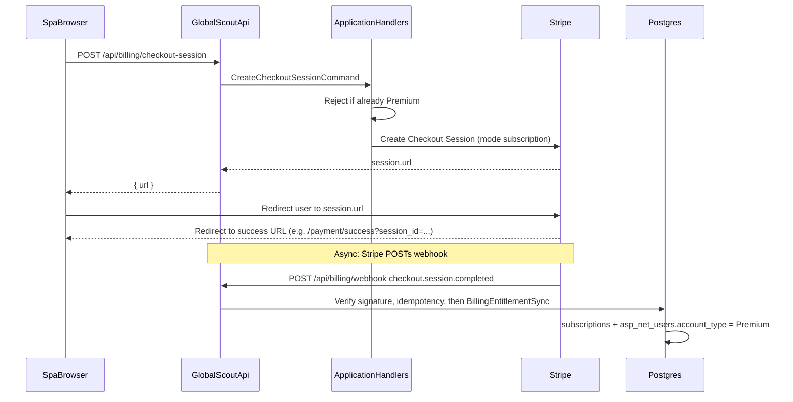
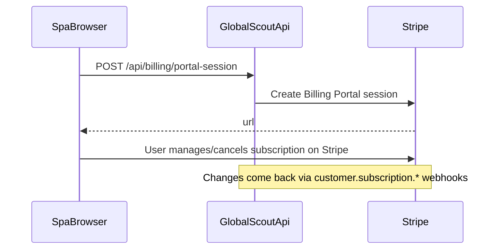

# Billing flow (Stripe)

This document describes how **Premium** is sold and enforced in GlobalScout: who calls whom, what gets persisted, and how webhooks stay safe to retry.

For local Stripe setup (CLI, secrets, test cards), see [STRIPE-BILLING.md](STRIPE-BILLING.md).

---

## Principles

| Layer | Responsibility |
|--------|-----------------|
| **Stripe** | Charges, subscription lifecycle, invoices, signatures on webhooks. |
| **GlobalScout.Api** | Authenticated checkout/portal endpoints; anonymous webhook endpoint with raw body + signature verification. |
| **Application** | Commands such as `CreateCheckoutSessionCommand` (validate “not already Premium”, call billing abstraction). |
| **Infrastructure** | `StripeBillingCheckoutService`, `StripeBillingPortalService`, `StripeWebhookProcessor`, and **`BillingEntitlementSync`** (DB + identity tier updates). |
| **Database** | Source of truth for **entitlements** in the app: `asp_net_users.account_type`, `subscriptions`, and `stripe_processed_webhook_events` (idempotency). |

Premium features read **account type** and subscription limits from your data; they do not call Stripe on every request.

---

## HTTP surface

| Method | Route | Auth | Purpose |
|--------|--------|------|---------|
| `POST` | `/api/billing/checkout-session` | Bearer | Create Stripe Checkout Session; response includes `url` to redirect the browser. |
| `POST` | `/api/billing/portal-session` | Bearer | Create Stripe Customer Portal session (requires existing `StripeCustomerId` on the user). |
| `POST` | `/api/billing/webhook` | None (Stripe signature) | Ingest Stripe events; update tiers and subscription rows. |

Checkout metadata includes `user_id` (GUID string) so webhooks can map payment back to a user even without relying on the client.

---

## Flow 1: New subscription (Checkout)

User is **Basic**, opens the upgrade UI, and starts checkout.

**What `BillingEntitlementSync` does on `checkout.session.completed`**

- Ensures the user has `StripeCustomerId` set.
- Upserts the `subscriptions` row: Premium tier, Stripe customer/subscription ids, active status.
- Calls `SetAccountTierFromBillingAsync` so `AccountType` becomes **Premium** (idempotent if already Premium).

The SPA success page polls profile/account until `accountType` reflects Premium (webhook may arrive a moment later).

---

## Flow 2: Webhook processing (inside the API)

All Stripe webhooks share the same safety pattern:

1. **Verify** the `Stripe-Signature` header with `Stripe:WebhookSecret` (`EventUtility.ConstructEvent`).
2. **Skip duplicates** if the event id is already in `stripe_processed_webhook_events`.
3. **Handle** by event type (see below).
4. **Record** the event id after successful handling (so retries do not double-apply side effects).

Handled event types (high level):

| Stripe `type` | Effect |
|-----------------|--------|
| `checkout.session.completed` | If `mode` is `subscription`, promote user and sync subscription row (see Flow 1). |
| `customer.subscription.updated` | Reconcile status (e.g. active, `past_due`, canceled) and period end from the subscription object. |
| `customer.subscription.deleted` | Revoke Premium for that Stripe subscription id. |
| `invoice.payment_failed` | Treat as `past_due` for the linked subscription (subscription id from invoice parent details). |

Mapping from Stripe subscription **status** strings to your domain is centralized in `BillingEntitlementSync` (e.g. `active` / `trialing` → Premium; terminal failure/cancel paths → Basic where applicable).

---

## Flow 3: Customer Portal

For users who already paid at least once (so `StripeCustomerId` exists):

Portal return URL is built from `Stripe:PublicAppBaseUrl` + `BillingPortalReturnPath`.

---

## Data touched

| Store | Fields / table |
|-------|----------------|
| `asp_net_users` | `account_type`, `stripe_customer_id`, `updated_at` |
| `subscriptions` | `tier`, `status`, `stripe_customer_id`, `stripe_subscription_id`, `start_date`, `end_date`, `updated_at` |
| `stripe_processed_webhook_events` | `event_id` (PK), `processed_at` |

---

## Related code (reference)

- API routes: [`GlobalScout.Api/Endpoints/Billing/`](../src/GlobalScout/GlobalScout.Api/Endpoints/Billing/)
- Webhook + Stripe SDK: [`GlobalScout.Infrastructure/Billing/`](../src/GlobalScout/GlobalScout.Infrastructure/Billing/)
- Commands: [`GlobalScout.Application/Billing/`](../src/GlobalScout/GlobalScout.Application/Billing/)
- Abstractions: [`IBillingEntitlementSync`](../src/GlobalScout/GlobalScout.Application/Abstractions/Persistence/IBillingEntitlementSync.cs), [`IBillingCheckoutService`](../src/GlobalScout/GlobalScout.Application/Abstractions/Billing/IBillingCheckoutService.cs)
- SPA: checkout via [`frontend/src/services/api.js`](../frontend/src/services/api.js) (`billingAPI`), success/cancel under [`frontend/src/pages/`](../frontend/src/pages/)

---

## Operational notes

- **Authoritative unlock** is the webhook path, not the browser redirect alone. The success page waits/polls until the DB shows Premium.
- **Idempotency** is per Stripe event id; duplicate deliveries should not change outcomes incorrectly.
- **Secrets** must never be committed; use user secrets or your deployment secret store (see [STRIPE-BILLING.md](STRIPE-BILLING.md)).
