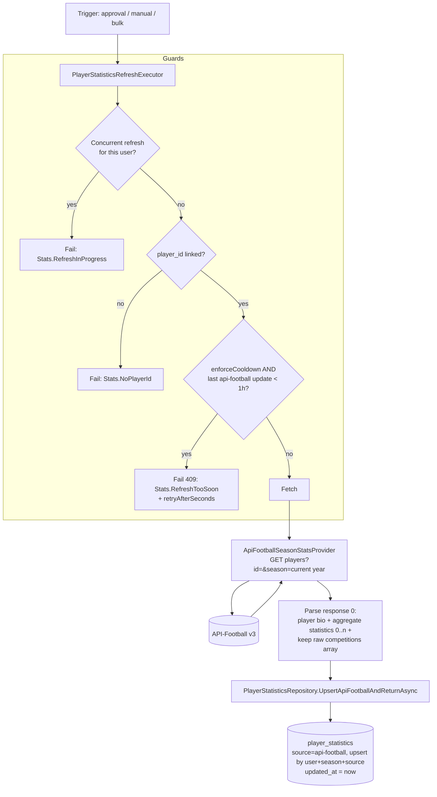
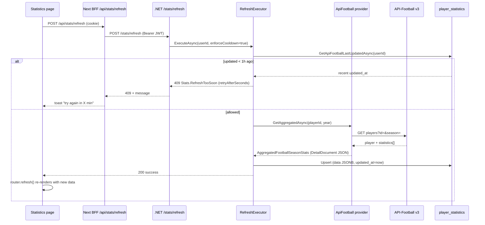
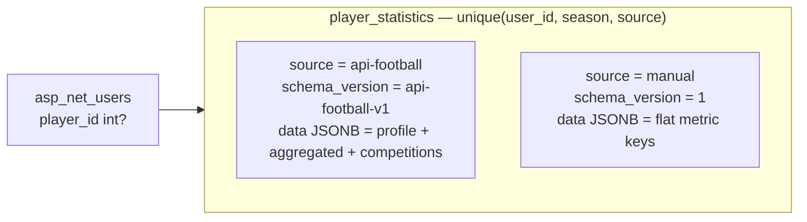

# Player statistics (API-Football)

This document describes how a verified player's football statistics are fetched, stored, refreshed, and displayed in GlobalScout: who calls whom, what gets persisted, and how the manual-refresh cooldown works.

Statistics are only meaningful **after** a player claims and an admin verifies their football identity, because that is when the external player ID is linked. For the identity/claim workflow, see the onboarding flow; this document starts at the point where `asp_net_users.player_id` is set.

---

## Principles

| Layer | Responsibility |
|-------|----------------|
| **API-Football** (`v3.football.api-sports.io`) | External source of truth for player bio + per-season, per-competition statistics. |
| **GlobalScout.Api** | Authenticated endpoints under `/api/stats/*`. |
| **Application** | `PlayerStatisticsRefreshExecutor` (fetch orchestration + guards), CQRS handlers for read/refresh, `StatsErrors`. |
| **Infrastructure** | `ApiFootballSeasonStatsProvider` (HTTP + parse), `PlayerStatisticsRepository` (JSONB upsert/read), `StatisticsUpdateState` (in-memory concurrency lock). |
| **Database** | Source of truth for stored stats: `player_statistics` (JSONB `data`), and `asp_net_users.player_id` (the linked API-Football player). |
| **Next.js UI** | Renders the dashboard cards and the `/statistics` page; triggers manual refresh via a BFF route. |

The UI never calls API-Football directly. Reads come from the database; the external provider is only hit during a refresh.

---

## HTTP surface

| Method | Route | Auth | Purpose |
|--------|-------|------|---------|
| `GET` | `/api/stats/me` | Bearer | Current user's stored stats (full detail). |
| `GET` | `/api/stats/user/{userId}` | Bearer | Another user's stats (tier-masked for Basic viewers). |
| `PUT` | `/api/stats/me` | Bearer | Manual stat entry (fallback / non-API source). |
| `POST` | `/api/stats/refresh` | Bearer | Refresh the current user's stats from API-Football (**1h cooldown**). |
| `POST` | `/api/stats/refresh/all` | Bearer (admin) | Bulk refresh every user with a linked player ID (no cooldown). |
| `GET` | `/api/stats/update-status` | Bearer | Bulk-update progress + last update timestamp. |

The Next.js app also exposes a thin BFF route `POST /api/stats/refresh` that forwards the browser's cookie session to the .NET endpoint as a Bearer token.

---

## What triggers a fetch

There are three entry points, all funneling into one shared orchestrator, `PlayerStatisticsRefreshExecutor.ExecuteAsync(userId, enforceCooldown, ct)`:

| Trigger | Source | `enforceCooldown` |
|---------|--------|-------------------|
| **Auto-fetch on approval** | `ApprovePlayerIdentityClaimCommandHandler` — right after it sets `player_id` | `false` |
| **Manual refresh** | Player clicks "Refresh stats" on `/statistics` | `true` |
| **Bulk refresh** | Admin calls `/stats/refresh/all` (loops all linked users, 1s delay between) | `false` |

The auto-fetch on approval is **best-effort**: it is wrapped in a `try/catch` and never fails the approval if API-Football is down or unconfigured. Stats can always be pulled later via manual refresh.

---

## Fetch → store pipeline



Guards, in order:

1. **Concurrency lock** — `StatisticsUpdateState` (in-memory singleton) rejects a second simultaneous refresh for the same user. It also gates the bulk refresh.
2. **Linked player** — `player_id` must be present on the user, else `Stats.NoPlayerId`.
3. **Cooldown** (manual only) — compares the persisted `updated_at` of the user's API-Football rows against `StatsErrors.RefreshCooldown` (1 hour). Because it reads from the DB, the cooldown survives app restarts.

---

## Manual refresh + cooldown (sequence)



The UI also disables the button and shows a live countdown during the cooldown window, but the **server is authoritative** — the client-side disable is only a UX nicety.

---

## Storage

Stats live in one table, keyed by a unique `(user_id, season, source)`. This lets a user have both a manual row and an API-Football row for the same season.



### API-Football `data` JSON shape

```json
{
  "seasonYear": 2026,
  "provider": "api-football",
  "profile": {
    "id": 123,
    "name": "…",
    "photo": "https://…",
    "height": "180 cm",
    "weight": "75 kg",
    "birth": { "date": "1999-…", "place": "…", "country": "…" },
    "nationality": "…",
    "age": 26
  },
  "aggregated": {
    "goals": 5, "assists": 2, "appearances": 20, "minutes": 1800,
    "yellowCards": 3, "redCards": 0, "rating": 7.1,
    "shotsTotal": 30, "shotsOnTarget": 12,
    "passesTotal": 900, "passesAccuracy": 82,
    "tacklesTotal": 18, "tacklesInterceptions": 9,
    "duelsWon": 40, "foulsCommitted": 10, "foulsDrawn": 12
  },
  "competitions": [
    { "team": { … }, "league": { … }, "games": { … }, "goals": { … }, "cards": { … } }
  ]
}
```

- `aggregated` is summed across every competition the player featured in for that season.
- `competitions` is the raw per-league/team `statistics[]` array from API-Football, preserved so the UI can render a breakdown table.
- `profile` is the player bio object from the same call.

> Note: the `season` for API-Football rows is the current calendar year. Multi-season history is not fetched today, but the `(user, season, source)` key already supports one row per season if that is added later.

---

## Read + display

```mermaid
flowchart TD
    UI[Statistics page / dashboard] --> Q[GET /stats/me]
    Q --> H[GetMyPlayerStatisticsQueryHandler]
    H --> RP[ListByUserAsync -> rows]
    RP --> MAP[PlayerStatisticsMapper]
    MAP --> FLAT["Flatten aggregated -> flat metric keys<br/>(ParseManualForMerge handles both<br/>flat manual rows and nested aggregated)"]
    MAP --> RAW["Pass raw data through<br/>(profile + competitions)"]
    FLAT --> RESP[Response: data[] + accountType + totalSeasons]
    RAW --> RESP
    RESP --> VM[buildStatisticsViewModel]
    VM --> CARDS[Stat cards]
    VM --> BIO[Profile bio strip]
    VM --> TABLE[Per-competition table]
```

Key details on the read path:

- The mapper **flattens** the `aggregated` object into top-level metric keys (`goals`, `assists`, `matches`, `passesAccuracy`, …) so the dashboard cards and the stats page read the same flat shape, regardless of whether the row is `manual` or `api-football`.
- The raw `data` (with `profile` and `competitions`) is also returned, which the `/statistics` page uses for the bio strip and the competition breakdown table.
- **Tier masking**: when viewing *another* user's stats and that user is on the **Basic** tier, `GET /stats/user/{userId}` returns a reduced set of metrics (`ToBasicMaskedDictionary`). Self-views and Premium targets get full detail.

---

## Error reference

| Code | HTTP | When |
|------|------|------|
| `Stats.RefreshInProgress` | 409 | A refresh for this user is already running (concurrency lock). |
| `Stats.NoPlayerId` | 400 | The user has no linked API-Football `player_id` (not yet verified). |
| `Stats.RefreshTooSoon` | 409 | Manual refresh attempted within 1h of the last one; includes `retryAfterSeconds`. |
| `Stats.ApiFootballNotConfigured` | 400 | No API key configured. |
| `Stats.ExternalUnavailable` | 400 | API-Football returned an error or an empty/invalid response. |
| `Stats.BulkRefreshInProgress` | 409 | A bulk admin refresh is already running. |

---

## Configuration

API-Football settings live under the `ApiFootball` config section (see `docs/AWS-infrastructure_setup_documentation.md` for production/env details):

```
ApiFootball__ApiKey=…
ApiFootball__Host=v3.football.api-sports.io
ApiFootball__BaseUrl=https://v3.football.api-sports.io
```

The refresh cooldown is defined in code as `StatsErrors.RefreshCooldown` (1 hour).

---

## Key files

| Area | Path |
|------|------|
| Refresh orchestrator + guards | `src/api/GlobalScout.Application/Statistics/RefreshMyStats/PlayerStatisticsRefreshExecutor.cs` |
| Errors + cooldown constant | `src/api/GlobalScout.Application/Statistics/StatsErrors.cs` |
| External fetch + parse | `src/api/GlobalScout.Infrastructure/Statistics/ApiFootballSeasonStatsProvider.cs` |
| JSONB upsert/read + cooldown lookup | `src/api/GlobalScout.Infrastructure/Statistics/PlayerStatisticsRepository.cs` |
| Concurrency lock | `src/api/GlobalScout.Infrastructure/Statistics/StatisticsUpdateState.cs` |
| Read flatten/mask | `src/api/GlobalScout.Application/Statistics/PlayerStatisticsMapper.cs` |
| Auto-fetch on approval | `src/api/GlobalScout.Application/PlayerIdentity/Admin/ApproveClaim/ApprovePlayerIdentityClaimCommandHandler.cs` |
| Endpoints | `src/api/GlobalScout.Api/Endpoints/Stats/` |
| Refresh BFF route | `src/ui/apps/web/app/api/stats/refresh/route.ts` |
| Stats page | `src/ui/apps/web/app/(app)/(player)/statistics/page.tsx` |
| View model builder | `src/ui/apps/web/features/statistics/build-statistics-view.ts` |
| Stats UI + refresh button | `src/ui/apps/web/features/statistics/` |
| Shared types | `src/ui/packages/shared/src/types/stats.ts` |
