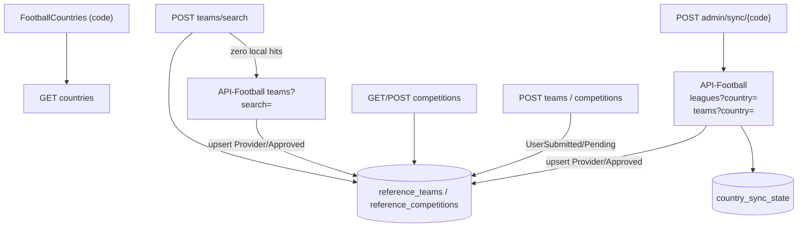

# Reference data catalog (countries, competitions, teams)

This document describes how GlobalScout stores and serves football reference data: the catalog model, how it is populated, search and submission behaviour, and what operators must do on a fresh environment.

The catalog is the backend for country dropdowns, club autocompletes, and competition pickers. Manual player statistics and identity onboarding both depend on it, but they use different slices of the data (see [Consumers](#consumers)).

---

## Principles

| Layer | Responsibility |
|-------|----------------|
| **API-Football** (`v3.football.api-sports.io`) | External source for bulk country sync and live club search fallback. |
| **GlobalScout.Api** | Authenticated endpoints under `/api/reference-data/football/*` plus admin sync under `/api/admin/reference-data/sync/{countryCode}`. |
| **Application** | `FootballCountries` (static list), CQRS handlers for search/list/submit/sync, `ReferenceDataErrors`. |
| **Infrastructure** | `ReferenceDataCatalog` (EF + `pg_trgm` search), `ApiFootballCountryReferenceDataProvider` (paged country sync), `ApiFootballTeamSearch` (write-through club search). |
| **Database** | `reference_teams`, `reference_competitions`, `country_sync_state`. Countries are **not** stored in the database. |
| **Next.js UI** | Proxies reference-data calls through `/api/reference-data/*` route handlers; identity onboarding uses `requiresExternalId: true` on team search. |

Countries work on a cold database with no API key. Competitions and teams require either an admin sync or write-through club search hits before pickers return local results.

---

## HTTP surface

### Public reference data (authenticated)

| Method | Route | Purpose |
|--------|-------|---------|
| `GET` | `/api/reference-data/football/countries` | Static country list (169 entries, derived flag URLs). |
| `POST` | `/api/reference-data/football/teams/search` | Search clubs in the catalog; optional provider fallback. Body: `{ country, searchTerm, requiresExternalId? }`. |
| `GET` | `/api/reference-data/football/competitions?country=&level?` | List competitions from the catalog only. |
| `POST` | `/api/reference-data/football/competitions/search` | Search competitions. Body: `{ country, searchTerm, level? }`. Catalog only. |
| `POST` | `/api/reference-data/football/teams` | Player submits an unlisted club (`UserSubmitted` / `Pending`). |
| `POST` | `/api/reference-data/football/competitions` | Player submits an unlisted competition with a **level hint**. |

### Admin

| Method | Route | Auth | Purpose |
|--------|-------|------|---------|
| `POST` | `/api/admin/reference-data/sync/{countryCode}` | Admin | Pull all competitions and teams for one country from API-Football, upsert into the catalog, stamp `country_sync_state`. |
| `GET` | `/api/admin/reference-data/countries` | Admin | Country list with competition counts, pending/needs-level counts, team count, and last sync timestamp. |
| `GET` | `/api/admin/reference-data/countries/{countryCode}/competitions` | Admin | All competitions for a country (including rejected), with source, status, and submission hints. |
| `PUT` | `/api/admin/reference-data/competitions/{competitionId}/level` | Admin | Set authoritative `Level` on a competition. Does not change `Source` (provider re-sync still refreshes names/logos). |
| `POST` | `/api/admin/reference-data/competitions/{competitionId}/approve` | Admin | Approve a pending user submission. Body: `{ level }` (required, not `Unknown`). |
| `POST` | `/api/admin/reference-data/competitions/{competitionId}/reject` | Admin | Reject a pending user submission (hidden from player search/list). |

Admin UI: `/admin/reference-data` lists countries (synced first), `/admin/reference-data/{countryCode}` reviews competitions for one country.

Phase 2 (not yet implemented): merge duplicates, team submission queue, broader admin curation tooling.

---

## Data model

### Countries (static, not in DB)

`FootballCountries` in the Application layer holds 169 `(Name, Code)` pairs. `ProviderName` is the slug API-Football expects (e.g. `Czech-Republic` for display name `Czech Republic`). Flag URLs follow `https://media.api-sports.io/flags/{code-lowercase}.svg`.

### Catalog rows

**Team** (`reference_teams`)

- **Identity:** catalog `Id` (Guid) for consumers that store a catalog reference; `ExternalTeamId` (nullable int) for API-Football.
- **Display:** `Name`, `Code`, `Founded`, `IsNational`, `LogoUrl`.
- **Provenance:** `Source` (`Provider`, `UserSubmitted`, `AdminCurated`), `Status` (`Approved`, `Pending`, `Rejected`, `Merged`).
- **Merge:** `MergedIntoTeamId` (admin tooling, phase 2).
- **Search:** `NameNormalized` (accent-stripped lowercase via `TextNormalizer.ToSearchKey`).

**Competition** (`reference_competitions`)

- Same provenance/status pattern as teams.
- **Level** — authoritative competition tier; admin-owned. Starts `Unknown` for provider and user submissions.
- **SubmittedLevelHint** — player's answer on submission; never copied into `Level` automatically.

**CountrySyncState** (`country_sync_state`)

- One row per synced country: timestamps, competition/team counts, `LastSyncedByUserId`.
- Ledger only; not a parent FK for teams or competitions.

### Indexes and search

- Unique filtered index on `external_team_id` / `external_competition_id` where not null.
- Non-unique `name_normalized` index per country (provider data has legitimate duplicate names).
- `pg_trgm` GIN index on `name_normalized` for fuzzy/prefix-accelerated autocomplete.

### DTO contract for consumers

`FootballTeamDto` / `FootballCompetitionDto` expose:

- `Id` — catalog Guid (store this in stats rows).
- `ExternalTeamId` / `ExternalCompetitionId` — nullable provider id.
- `IsVerified` — `true` when `Status == Approved`.
- `Level` on competitions.

Downstream features should store **catalog id + denormalized name** so display survives merges and admin corrections.

---

## How the catalog gets populated

### Admin per-country sync (bulk population)

`SyncCountryReferenceDataCommandHandler`:

1. Resolves country code against `FootballCountries`.
2. Calls `GetTeamsAsync` and `GetLeaguesAsync` with the provider country slug.
3. Upserts all rows by external id.
4. Records sync state and returns `{ fetched, added, updated }` counts per entity type.

**Paging:** `ApiFootballCountryReferenceDataProvider` reads `paging.total` from the first response and requests `page=2..N`. The first request omits `page` (some endpoints do not accept `page=1`).

**Never deletes:** provider rows that disappear upstream remain in the catalog because stats may reference them.

### Write-through club search (gap-filler)

`SearchFootballTeamsQueryHandler`:

1. Search catalog (min 2 characters).
2. If **zero** local results and search term ≥ 3 characters, call `IExternalTeamSearch` (live `teams?search=&country=`).
3. Upsert hits as `Provider` / `Approved` and return persisted DTOs (real catalog ids).

Competition search/list does **not** call the provider per request; unsynced countries rely on player submissions for competitions.

### Optional filter: `requiresExternalId`

When `true`, catalog search excludes teams without `ExternalTeamId`. Identity onboarding sets this so only API-Football-linked clubs appear. Default `false` keeps pending user-submitted clubs visible to manual statistics pickers.

---

## Submissions and throttling

Players (`POST` teams/competitions) create `UserSubmitted` / `Pending` rows:

- Clubs: no external id.
- Competitions: `Level` stays `Unknown`; `SubmittedLevelHint` stores the player's tier answer.
- Pending rows are **visible to everyone** (with `IsVerified: false` in DTOs) to avoid duplicate submissions of the same amateur club.

**Throttle:** max **5 combined** pending team + competition submissions per user. Enforced inside `ReferenceDataCatalog` with a per-user PostgreSQL advisory transaction lock so concurrent submits cannot bypass the cap.

---

## Consumers

| Feature | Team search | Competition search | Submissions |
|---------|-------------|---------------|-------------|
| **Identity onboarding** | `requiresExternalId: true`; stores API-Football team id for player search | Not used | Not used |
| **Manual statistics** (planned) | Catalog id; pending clubs allowed | Catalog id; level filter | Submit if not listed |
| **Admin sync** | Bulk upsert | Bulk upsert | — |

Identity claim creation still requires a matched API-Football player id. There is no self-reported identity branch; catalog-only clubs are intentionally excluded from identity team pickers.

---

## First-run operator steps

A fresh database has **no teams or competitions** until someone populates them.

1. **Countries** — no action; `GET /api/reference-data/football/countries` works immediately.
2. **API key** — set `ApiFootball:ApiKey` (or environment equivalent) on the API host. Sync and write-through search fail without it.
3. **Sync priority countries** — as admin, call `POST /api/admin/reference-data/sync/{countryCode}` for each country your players use (e.g. `RO`, `GB` for England). One sync pulls that country's full competition and team lists.
4. **Verify** — `GET /api/reference-data/football/competitions?country=Romania` should return synced competitions; club autocomplete should return local hits before hitting the live provider.
5. **Local development** — same as production: migrator applies schema (including `pg_trgm`); Docker Compose `postgres:17-alpine` runs as superuser so the extension installs without extra privileges.

Until sync runs, club search in unsynced countries still works via write-through (live API call on miss). Competition pickers in those countries only show player-submitted competitions.

---

## Configuration

| Setting | Purpose |
|---------|---------|
| `ApiFootball:ApiKey` | Required for sync and external team search. |
| `ApiFootball:BaseUrl` | Defaults to API-Football v3 base URL. |

---

## Tests

| Area | Location |
|------|----------|
| Static countries | `FootballCountriesTests` |
| Team search handler (catalog hit, miss+upsert, `requiresExternalId`) | `SearchFootballTeamsQueryHandlerTests` |
| Competition list/search handlers | `FootballCompetitionQueriesTests` |
| Submissions + level hint validation | `ReferenceDataSubmissionTests` |
| Country sync handler | `SyncCountryReferenceDataCommandHandlerTests` |
| Provider paging (teams + competitions) | `ApiFootballCountryReferenceDataProviderTests` |
| Catalog search ranking, upsert dedupe, admin preservation, throttling, endpoints | `ReferenceDataCatalogIntegrationTests` |

Integration tests substitute the external provider for player identity; reference-data integration tests exercise the real catalog against Testcontainers PostgreSQL.

---

## Related documentation

- [Player statistics](PLAYER-STATISTICS.md) — uses linked API-Football player id after identity verification; manual stats will reference catalog ids from this subsystem.
- [AWS infrastructure](AWS-infrastructure_setup_documentation.md) — production Compose stack and API URL conventions.
