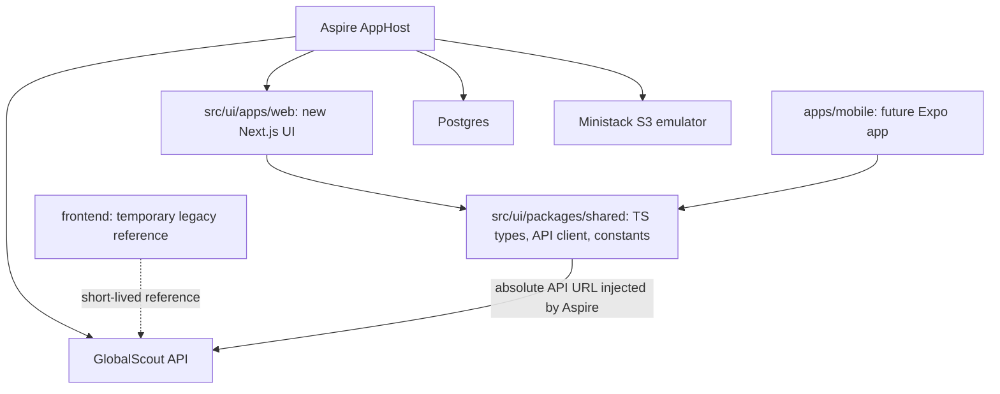
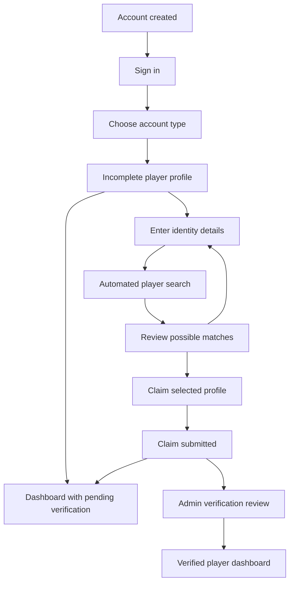
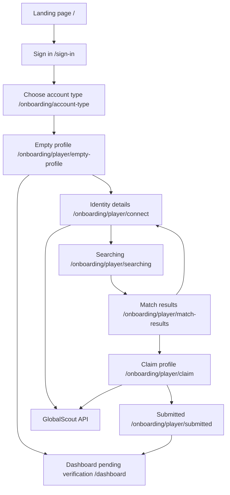

# Next.js Web Platform Plan

## Direction

Treat the new UI as a fresh TypeScript product surface and the future source of truth. Keep `[frontend/](../frontend/)` only as a short-lived legacy reference while adding the new web app under `[src/ui/apps/web](../src/ui/apps/web/)` and shared TypeScript code for web and future mobile under `[src/ui/packages/shared](../src/ui/packages/shared/)`.

Use a modern workspace layout that serves the Next.js + future Expo direction. The default recommendation is pnpm workspaces because it is strong for TypeScript monorepos, has good Next/Expo compatibility, and keeps shared packages explicit. npm workspaces remain a viable lower-friction option, but the choice should be made for the new architecture rather than inherited from the legacy frontend.

Use this frontend stack for the new web platform:

- Next.js with App Router
- React 19
- TypeScript strict mode
- Latest stable Tailwind CSS v4 release
- shadcn/ui
- Base UI as the default shadcn primitive layer, with Radix UI only as a fallback if Base UI blocks a needed component
- React Hook Form + Zod
- TanStack Query
- TanStack Table for data-heavy product/admin screens when those arrive
- Recharts for charts, with Tremor-style visual treatment implemented through our own components/theme

Design local development around Aspire from the start. The main dev path should be launching the .NET AppHost and having it start the API, database, object-storage emulator, and the new Next.js web app together. The standalone web command remains useful, but it is secondary.

Use Next.js as a full web application platform: App Router, React Server Components, layouts, route groups, metadata, server-side session checks, streaming/loading states, and server/client boundaries where they improve correctness or user experience. Prefer a Next standalone runtime for production unless we deliberately decide the app can be fully static later.



## Scaffold Changes

- Add root `[package.json](../package.json)` plus workspace configuration for `apps/*` and `packages/*`, with scripts such as `dev:web`, `build:web`, `lint:web`, and later `dev:mobile`.
- Scaffold `[src/ui/apps/web](../src/ui/apps/web/)` as a Next.js TypeScript app using App Router, route groups, ESLint, the latest stable Tailwind CSS v4 release, strict TypeScript, shadcn/ui, and Base UI primitives.
- Make the public landing page from the [Figma mockup](https://www.figma.com/make/d4rD1j2YWlYcMcttlyoObo/Globalscout?code-node-id=0-9&p=f&t=BN1k5acq6eP3amTR-0&fullscreen=1) the first real route at `/`, rather than a throwaway starter page.
- Add `[src/ui/apps/web/.env.example](../src/ui/apps/web/.env.example)` for standalone development, but make Aspire-injected environment variables the primary local dev path.
- Add `[src/ui/packages/shared](../src/ui/packages/shared/)` as a TypeScript package for shared domain types, API URL helpers, constants, and a typed API client foundation.
- Update `[.gitignore](../.gitignore)` because it currently ignores `/packages/*`; add an exception so `[src/ui/packages/shared](../src/ui/packages/shared/)` can be tracked.
- Add the new web Dockerfile and CI/build wiring early, so the `ui` service can move from `[frontend/](../frontend/)` to `[src/ui/apps/web](../src/ui/apps/web/)` soon after the app shell and auth/API foundation are in place.

## Web Platform Architecture

Structure `[src/ui/apps/web](../src/ui/apps/web/)` as a serious application, not a pile of pages:

```text
src/ui/apps/web/
  app/
    (marketing)/
      page.tsx
    (auth)/
      sign-in/
        page.tsx
      create-account/
        page.tsx
      forgot-password/
        page.tsx
    (onboarding)/
      onboarding/
        layout.tsx
        account-type/
          page.tsx
        player/
          empty-profile/
            page.tsx
          connect/
            page.tsx
          searching/
            page.tsx
          match-results/
            page.tsx
          claim/
            page.tsx
          submitted/
            page.tsx
    (app)/
      layout.tsx
      dashboard/
        page.tsx
        verified/
          page.tsx
      profile/
        page.tsx
      search/
        page.tsx
      users/
        [id]/
          page.tsx
      connections/
        page.tsx
      messages/
        page.tsx
        [userId]/
          page.tsx
      billing/
        page.tsx
        success/
          page.tsx
        cancel/
          page.tsx
      admin/
        page.tsx
    api/
      auth/
        sign-in/
          route.ts
    layout.tsx
    globals.css
  components/
    ui/
    layout/
    marketing/
    auth/
    dashboard/
    onboarding/
  features/
    auth/
    account/
    dashboard/
    discovery/
    users/
    profile/
    social/
      connections/
      follow/
      messages/
    media/
    stats/
    billing/
    admin/
    onboarding/
      player/
        identity-linking/
        verification/
  hooks/
  lib/
    api/
    auth/
    env/
    validation/
    query/
    signalr/
    storage/
    onboarding/
  styles/
  tests/
```

- Use route groups to separate public marketing, auth, onboarding, and authenticated app surfaces without leaking layout concerns across them.
- Use Server Components by default for pages, layouts, static marketing sections, authenticated shell bootstrapping, and metadata.
- Use Client Components only for interactive UI: forms, menus, toasts, optimistic mutations, multi-step onboarding controls, and components that need browser APIs.
- Use Next route handlers as a backend-for-frontend layer only where useful: sign-in/session cookie management, secure proxying for browser-sensitive operations, or platform-level concerns. Do not duplicate the .NET API domain logic in Next.
- Use `middleware.ts` or server-side layout guards for authenticated route protection, depending on the final cookie/session approach.
- Use `loading.tsx`, `error.tsx`, `not-found.tsx`, and route-level metadata from the start so the platform has consistent loading, failure, SEO, and sharing behavior.
- Use Next image/font optimization for landing and product UI assets when compatible with deployment constraints.

## Product Feature Model

Model the web app around the backend feature boundaries and current product surface, not around the legacy frontend implementation.

```text
features/
  auth/                 # sign-in, session, route guards
  account/              # account info, tier, limits, upgrade/downgrade
  dashboard/            # home widgets, recommendations, pending requests
  discovery/            # user search, filters, recommendation cards
  users/                # public user profile views
  profile/              # own profile editing, avatar, visitors, privacy surface
  social/
    connections/        # mutual connection requests and network list
    follow/             # followers, following, follow status
    messages/           # inbox, threads, compose, realtime client
  media/                # video upload, gallery, presigned read URLs
  stats/                # player statistics, refresh, tier-gated views
  billing/              # checkout, portal, success/cancel handling
  admin/                # admin users table, moderation, platform stats
  onboarding/
    player/
      identity-linking/ # external player search, candidate matching, selected match
      verification/     # claim submission, evidence, status timeline
```

Route these features through App Router groups:

- `(marketing)`: `/` landing page from Figma.
- `(auth)`: `/sign-in` for the login experience after account creation, plus `/create-account` and `/forgot-password` when those flows are enabled.
- `(onboarding)`: authenticated, no-sidebar onboarding flow at `/onboarding/...` for account type selection and player identity linking.
- `(app)`: authenticated product shell with `/dashboard`, `/dashboard/verified`, `/profile`, `/search`, `/users/[id]`, `/connections`, `/messages`, and `/messages/[userId]`.
- `(billing)` or nested app routes: `/billing`, `/billing/success`, `/billing/cancel` for Stripe-driven flows.
- `(admin)`: admin-only route group for moderation and platform metrics.

Map API clients one-to-one with backend domains:

```text
lib/api/
  auth.ts
  account.ts
  users.ts
  stats.ts
  media.ts
  billing.ts
  connections.ts
  follow.ts
  messages.ts
  admin.ts
  player-identity.ts
```

- `auth`: `POST /auth/login`, `GET /auth/profile`, `POST /auth/logout`; registration can be supported when the account-creation flow is finalized.
- `account`: `GET /account/info`, `POST /account/upgrade`, `POST /account/downgrade`.
- `users`: own profile, public profiles, avatar upload, search, recommendations, visitors.
- `stats`: own/user stats, refresh, update status, admin refresh-all.
- `media`: video upload URL, complete upload, video list, read URL, delete.
- `billing`: checkout session and billing portal session; webhook remains backend-only.
- `connections`: list, pending requests, send, respond.
- `follow`: follow/unfollow, followers, following, stats, status.
- `messages`: conversations, thread, send, mark read, plus SignalR integration under `lib/signalr`.
- `admin`: user list, status update, delete user, platform stats.
- `player-identity`: implemented backend endpoints for player identity search, candidate matching, claim submission, evidence upload/link submission, current claim status, and admin verification review.

Treat these as the initial product capabilities:

- Landing page and sign-in are the first public surfaces.
- Join as a Player is the first authenticated onboarding surface and should follow the player identity linking flow from the Figma spec and PDF.
- Dashboard, search, profile, public user profile, connections, messages, media, stats, billing, and admin are planned feature modules from the start so folder structure and API contracts do not need to be reshuffled later.
- Do not carry over legacy-only gaps as product commitments: the old football import API route is not present in the current backend, and profile privacy controls need backend confirmation before implementation.

## Player Onboarding And Identity Linking

The player onboarding experience is no longer a placeholder. It should reflect the Figma-generated flow in `[docs/figma-specs.md](figma-specs.md)` and the verification proposal in `[docs/Global Scout – Player Identity Linking & Verification.pdf](Global%20Scout%20%E2%80%93%20Player%20Identity%20Linking%20%26%20Verification.pdf)`.

Keep onboarding in its own protected route group so it can use a focused progress layout instead of the main dashboard/sidebar shell:

```text
app/(onboarding)/
  onboarding/
    layout.tsx
    account-type/page.tsx
    player/
      empty-profile/page.tsx
      connect/page.tsx
      searching/page.tsx
      match-results/page.tsx
      claim/page.tsx
      submitted/page.tsx
```

The player flow should be:



Collect player identity inputs that help automated matching without requiring third-party IDs:

- Full name
- Date of birth
- Nationality
- Current club
- Previous club, optional
- Position
- League or competition, optional

Model the automated matching UI around candidate profiles with:

- Player name
- Club
- Position
- Nationality
- Age
- League or competition when available
- Profile photo when available
- Confidence score
- Match reasons such as exact name, date of birth, club, nationality, position, age, or league match

Model claim and verification as explicit states:

```text
unmatched
suggested
claimed
pending_verification
verified
rejected
```

Selecting a match must not immediately verify the player. It creates a claim and provisional link, then admin review decides whether the claim is approved, rejected, or needs more information. While pending, the user can continue into the dashboard with a pending verification banner; statistics can be shown as unverified/provisional if the backend supports it.

The implemented backend currently exposes these `ClaimStatus` values: `Unmatched`, `Suggested`, `Claimed`, `PendingVerification`, `Verified`, and `Rejected`. The admin "request more information" action stores an admin note and review metadata without a separate public `NeedsMoreInformation` enum value, so the web UI should render that state from the returned claim note/status combination unless the backend later adds a distinct status.

Plan these feature modules:

```text
features/onboarding/player/
  components/
    AccountTypeCard.tsx
    EmptyProfileSkeleton.tsx
    PlayerIdentityForm.tsx
    SearchingAnimation.tsx
    MatchResultCard.tsx
    ClaimProfileComparison.tsx
    EvidenceUpload.tsx
    VerificationTimeline.tsx
    SubmittedInfoCard.tsx
  schemas/
    player-identity.schema.ts
    player-claim.schema.ts
  types/
    player-identity.ts
  hooks/
    usePlayerIdentityDraft.ts
    usePlayerMatchSearch.ts
    usePlayerClaim.ts
```

Use the implemented backend API:

Player endpoints require the `PLAYER` role:

```text
POST api/player-identity/search
POST api/player-identity/claims
GET  api/player-identity/claims/me
POST api/player-identity/claims/me/evidence/upload-url
POST api/player-identity/claims/me/evidence/complete
POST api/player-identity/claims/me/evidence/link
```

Admin endpoints require the `ADMIN` role:

```text
GET  api/admin/player-claims
POST api/admin/player-claims/{claimId}/approve
POST api/admin/player-claims/{claimId}/reject
POST api/admin/player-claims/{claimId}/request-info
```

The web client should model the implemented request contracts:

```text
PlayerIdentitySearchRequest:
  fullName
  dateOfBirth
  nationality
  currentClub
  position
  previousClub?
  league?

CreatePlayerIdentityClaimRequest:
  externalPlayerId
  provider?
  fullName
  dateOfBirth
  nationality
  currentClub
  position
  previousClub?
  league?

InitiateEvidenceUploadRequest:
  fileName
  contentType
  contentLength

CompleteEvidenceUploadRequest:
  storageKey
  fileName
  contentType
  type
  note?

AddLinkEvidenceRequest:
  type
  url
  note?
```

The web client should model the implemented response DTOs:

- `SearchPlayersResult` with `matches: PlayerMatchDto[]`.
- `PlayerMatchDto`: `externalPlayerId`, `provider`, `name`, `club`, `position`, `nationality`, `age`, `photoUrl`, `confidenceScore`, `reasons`, `recommended`.
- `PlayerIdentityClaimDto`: claim id/status, selected candidate details, confidence score, admin note, reviewed/created/updated timestamps, and `evidence`.
- `GetMyPlayerIdentityClaimResult`: current status plus nullable claim.
- `VerificationEvidenceDto`: evidence id, type, storage key or URL, note, created timestamp.
- `ListPendingPlayerClaimsResult`: pending claims with user id, email, and optional user full name.

Evidence type options should match the backend enum: `RosterListing`, `FederationCard`, `ClubId`, `ProfileUrl`, `SocialAccount`, `Other`, `Passport`, and `CountryPersonalId`.

Treat the Figma spec as a visual and product-experience guide, not as source code to copy or an unquestioned architecture source. The plan should adopt its screen sequence, layout intent, component ideas, and interaction states, but implementation must use the current stable versions and conventions for Next.js, React, Tailwind, shadcn/ui, and Base UI.

### Figma Spec Alignment Notes

The Figma-generated spec is useful for screen sequence, layout intent, component inventory, and interaction states. Any code snippets from Figma should be treated as illustrative pseudocode and adapted during implementation:

- Keep the `/onboarding/...` URL structure, but implement it as `app/(onboarding)/onboarding/...` so Next route groups do not accidentally remove the `onboarding` path segment.
- Convert Tailwind snippets to the latest stable Tailwind CSS v4 conventions. The spec includes older `@tailwind base/components/utilities` and HSL token examples; the app should use the v4 CSS-first setup, current PostCSS integration, and current shadcn v4 token format.
- Do not copy Figma-generated React or Tailwind code verbatim. Recreate the design with typed components, accessible shadcn/Base UI primitives, our route structure, our validation schemas, and current framework APIs.
- Use pnpm workspace commands even if the Figma spec shows npm commands.
- Keep dashboard routes aligned with the platform route model. The Figma spec separates `/dashboard/scout/...`; the final route shape should still respect role-based layouts and backend feature modules rather than hard-coding a second app architecture for scouts.
- Treat social login, forgot password, agent onboarding, AI Scout, and detailed settings as planned surfaces only when backend support and product requirements exist.

## Components And Styling

- Use the latest stable Tailwind CSS v4 release as the styling foundation with design tokens expressed through CSS variables in `[src/ui/apps/web/app/globals.css](../src/ui/apps/web/app/globals.css)`.
- Build a local component system under `[src/ui/apps/web/components/ui](../src/ui/apps/web/components/ui/)` for primitives like `Button`, `Input`, `Label`, `Card`, `Dialog`, `Dropdown`, `Tabs`, `Stepper`, `Avatar`, `Badge`, and `FormField`.
- Use shadcn/ui with Base UI underneath by default, while keeping ownership of the generated components in the repo. Use Radix UI only if a specific Base UI component becomes a blocker.
- Keep feature-specific components beside their feature area, for example landing sections in `components/marketing` and onboarding steps in `components/onboarding`.
- Reflect the Figma spec's onboarding component set: `OnboardingHeader`, `AccountTypeCard`, `EmptyProfileSkeleton`, `ConnectIdentityCard`, `PlayerIdentityForm`, `SearchingAnimation`, `MatchResultCard`, `ClaimProfileComparison`, `EvidenceUpload`, `VerificationTimeline`, and `SubmittedInfoCard`.
- Reflect the Figma spec's dashboard verification components: `VerificationBanner`, `PlayerProfileHeader`, `StatCard`, `VideoHighlightCard`, `PerformanceRadarChart`, `ProfileViewsChart`, `MatchHistoryList`, and `RecentActivityList`.
- Use class utilities such as `cn()` and a variant system such as `class-variance-authority` for reusable component variants.
- Add responsive layout primitives early: page shells, section containers, max-width wrappers, split panels, and mobile navigation.
- Use Recharts for charts and implement Tremor-style dashboard visuals through our own Tailwind/shadcn component layer instead of depending on Tremor by default.

## Types, Validation, And Forms

- Keep cross-platform domain types in `[src/ui/packages/shared](../src/ui/packages/shared/)`, especially API request/response models, IDs, enums, onboarding models, and shared constants.
- Keep web-only types in `[src/ui/apps/web](../src/ui/apps/web/)` when they involve Next, React, DOM APIs, route params, cookies, or form UI state.
- Use Zod schemas for runtime validation at boundaries: env variables, API responses where needed, and forms.
- Use React Hook Form with Zod resolvers for sign-in and player onboarding forms.
- Plan for generated TypeScript API types from the .NET OpenAPI document once the backend contract is stable enough; hand-written types are acceptable during the first slice.

## API Clients And Data Fetching

- Create a shared transport layer in `[src/ui/packages/shared](../src/ui/packages/shared/)` for URL resolution, request/response typing, error normalization, and API module boundaries.
- Create web-specific API clients in `[src/ui/apps/web/lib/api](../src/ui/apps/web/lib/api/)` that adapt the shared transport to Next server/client contexts.
- Use server-side API calls for authenticated page bootstrapping and session-aware redirects.
- Use TanStack Query on the client for interactive, cacheable product data and mutations such as onboarding steps, profile updates, recommendations, and messages.
- Use TanStack Table for data-heavy tables once admin, search results, scouting lists, or analytics screens require sorting, filtering, pagination, and column control.
- Keep upload helpers cross-platform where possible, but isolate browser `File` handling and future Expo file handling behind adapters.
- Preserve the production invariant that public browser calls use `https://api.globalscout.eu/api` or the Aspire-injected equivalent, not relative `/api` from the frontend domain unless intentionally routed through a Next handler.

## Hooks, State, And App Providers

- Keep hooks focused and feature-oriented: `useSignIn`, `useCurrentUser`, `usePlayerOnboarding`, `useMediaUpload`, and `useProtectedNavigation`.
- Use React Context sparingly for true app-wide concerns such as theme, current session snapshot, and toast infrastructure.
- Use TanStack Query for server state rather than duplicating API data in local stores.
- Avoid adding a global client store until there is a clear need for complex client-only state.
- Add a single `Providers` component for query client, theme, toasts, and any future analytics/session providers.

## Quality Bar

- Enable strict TypeScript and keep `noImplicitAny`/strict null checks on.
- Add linting and formatting from the start, including import ordering if it does not fight the framework.
- Add focused tests around shared API utilities, validation schemas, and critical auth/onboarding behavior.
- Add Playwright later for the core browser journeys: landing CTA, sign-in, route protection, and player onboarding.

## Landing Page

Use the provided [Figma mockup](https://www.figma.com/make/d4rD1j2YWlYcMcttlyoObo/Globalscout?code-node-id=0-9&p=f&t=BN1k5acq6eP3amTR-0&fullscreen=1) as the design source for the new web app's `/` route.

- Build the landing page as production code from the start, with section-level components under `[src/ui/apps/web](../src/ui/apps/web/)`.
- Extract reusable primitives only when they naturally appear in the landing page, such as buttons, section containers, cards, navigation, and footer elements.
- Treat the Figma design as the visual target for spacing, typography, color, layout, and responsive behavior.
- Keep marketing/landing page components in the web app rather than `[src/ui/packages/shared](../src/ui/packages/shared/)`; shared packages should stay focused on cross-platform business logic and types.
- Before implementation, confirm access to the design details or capture/export the needed assets from Figma so the build is not based on guesswork.

## Initial Product Flow

Focus the first usable slice on the player identity linking path:



- Public route: `/` for the Figma landing page with primary calls to action that lead to sign-in or account creation depending on the final copy.
- Public route: `/sign-in` for users who already have an account.
- Authenticated route group: `/onboarding/...` for account type selection and player identity linking after the account exists and the user has signed in.
- Add route protection early so onboarding pages are not accessible without an authenticated session.
- Build the onboarding shell around progress state, step layout, form primitives, validation structure, candidate selection, evidence upload, claim submission, and verification timeline.
- Keep backend integration behind typed API clients that call the implemented player identity search, claim, evidence, and status endpoints.

## Shared Code Boundary

Start by sharing stable non-UI code only:

- API base URL helpers designed around the backend and AWS invariants, using `NEXT_PUBLIC_API_BASE_URL` for web and a mobile-safe equivalent later.
- Domain/API types for auth, users, media, connections, follows, messages, billing, stats, and admin modules.
- API client modules that preserve production invariants: browser calls use an absolute API base and SignalR uses the API origin, not the frontend origin.
- A small auth token abstraction so web can use cookies now and Expo can later use SecureStore without changing call sites.

Avoid sharing UI components at this stage. Cross-platform UI sharing can be revisited later with Expo-specific choices such as NativeWind, Tamagui, or Solito, but that decision would heavily shape both apps.

## Local Dev Integration

Make Aspire the primary development orchestrator and make the new UI the default local frontend:

- Keep `[frontend/](../frontend/)` available as a short-lived reference, but remove it from the normal development path.
- Add a clear standalone command for the new UI, for example `pnpm dev:web`, mainly for UI-only iteration.
- Update `[src/api/GlobalScout.AppHost/AppHost.cs](../src/api/GlobalScout.AppHost/AppHost.cs)` during initial scaffolding, not later, so the new Next.js app launches from Aspire alongside `globalscout-api`, Postgres, and Ministack.
- Use Aspire JavaScript hosting from `[src/api/GlobalScout.AppHost/GlobalScout.AppHost.csproj](../src/api/GlobalScout.AppHost/GlobalScout.AppHost.csproj)` to run the workspace command for `[src/ui/apps/web](../src/ui/apps/web/)`, likely through an npm/pnpm app resource with the exact API verified during implementation.
- Inject `NEXT_PUBLIC_API_BASE_URL` from the API HTTPS endpoint, using the same direct-browser API model required by production: `{api-https-endpoint}/api`.
- Inject any needed local SignalR/public URL variables from the API HTTPS origin instead of deriving them from the frontend host.
- Feed the Aspire-assigned Next.js origin back into `Cors__AllowedOrigins` so CORS follows whatever localhost/dev-host port Aspire assigns.
- Ensure the Aspire dashboard shows the new web app as a first-class resource with logs, health/startup visibility, and endpoint links.

## Early Cutover

Plan for the new web UI to take over the `ui` deployment path early. The first scaffold can coexist briefly, but once the app shell, auth entry points, API base URL handling, and Docker build are validated, switch the local and deployment wiring to `[src/ui/apps/web](../src/ui/apps/web/)`.

- Add `[src/ui/apps/web/Dockerfile](../src/ui/apps/web/Dockerfile)` during scaffolding, defaulting to Next standalone output so App Router server features, route handlers, server-side session checks, streaming, and metadata remain available.
- Update the runtime model for the `ui` container from nginx-served static assets to a Next Node server unless a later decision intentionally constrains the app to static export.
- Update `[.github/workflows/deploy-aws.yml](../.github/workflows/deploy-aws.yml)` to build `src/ui/apps/web` with `NEXT_PUBLIC_API_BASE_URL=https://api.globalscout.eu/api`.
- Update `[docker-compose.yml](../docker-compose.yml)` and `[deploy/docker-compose.ec2.yml](../deploy/docker-compose.ec2.yml)` early so the `ui` service builds/runs the new app instead of the legacy frontend.
- Update `[docs/AWS-infrastructure_setup_documentation.md](AWS-infrastructure_setup_documentation.md)` and `[docs/AWS-GITHUB-DEPLOYMENT.md](AWS-GITHUB-DEPLOYMENT.md)` as part of the cutover work, not as a distant follow-up.
- Do not add compatibility shims for the legacy UI. If a route, env var, or workflow only exists for the old UI and is no longer needed, replace it.

## Implementation Sequence

1. Create the TypeScript workspace skeleton and fix `.gitignore` so new JS packages are tracked.
2. Scaffold `src/ui/apps/web` with Next.js App Router, TypeScript strict mode, Tailwind, ESLint, route groups, root providers, and the Figma landing page as the initial `/` route.
3. Establish the folder architecture for components, features, hooks, `lib/api`, `lib/auth`, `lib/env`, `lib/validation`, app providers, loading states, error boundaries, and route metadata.
4. Create `src/ui/packages/shared` with `tsconfig`, package exports, API URL utilities, error types, domain types, constants, and initial validation schemas.
5. Wire `src/ui/apps/web` to consume `src/ui/packages/shared` through package imports and strict TypeScript references.
6. Add the `/sign-in` route with form validation, session/cookie handling, and the account login flow wired to the API through the web API client.
7. Add the authenticated `/onboarding/account-type` and `/onboarding/player/*` route sequence for player identity linking, including route protection, progress layout, form primitives, candidate cards, claim comparison, evidence upload, submitted state, and pending verification dashboard handoff.
8. Add `player-identity` API client and shared types for the implemented identity search input, match candidates, confidence scores, match reasons, claim submission, evidence metadata, verification status, and admin review endpoints.
9. Add the new Next.js app to `GlobalScout.AppHost` as an Aspire-managed JavaScript resource with API URL injection and CORS origin wiring.
10. Add the Next standalone Dockerfile and root scripts for the new default frontend workflow.
11. Update local dev documentation so the preferred workflow is starting Aspire and opening the web endpoint from the Aspire dashboard.
12. Switch local Docker and CI deployment build references from the legacy frontend to `src/ui/apps/web` once the landing page, sign-in, onboarding flow, and API config are validated.
13. Run install/build/lint checks for the new workspace and verify the Aspire startup path launches API dependencies and the new web app together.
